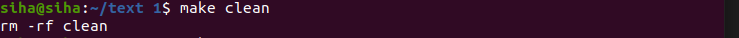

Makefile
======

### MakeFile規則

+ 在Ubuntu系統內，先安裝**vim**，**gcc**，**g++**，**make**套件，指令如下

```
sudo apt-get install vim

sudo apt-get install gcc

sudo apt-get install g++

sudo apt-get install make

```

+ 安裝完後建立一個專案，裡面放置Makefile和自己的Code

```
mkdir text

cd text

touch text.cpp

touch Makefile

```

+ 創建Makefile檔建議取名為makefile/**Makefile(最佳)**/GNUmakefile，這樣在輸入make指令系統會預設去找這三個名子，若取不同名子，執行Make指令更改為


```

make -f <你的Makefile>

```
### Makefile基本語法格式

+ 命令必須以tab開頭，不能是4個空格

+ 依賴不一定要存在，如果不存在對應的命令會強制執行

```
<目標> : <依賴>

<tab><命令>

hello:hello.c
	gcc hello.c -o hello

hello為目標，它所依賴hello.c這檔案

gcc hello.c -o hello為命令，將hello.c檔案編譯成hello.o檔

```

+ 以下為簡單Makefile例子，有3個header檔和8個.c檔

```

edit : main.o kbd.o command.o display.o insert.o search.o files.o utils.o

    cc -o edit main.o kbd.o command.o display.o insert.o search.o files.o utils.o

 
main.o : main.c defs.h

        cc -c main.c

kbd.o : kbd.c defs.h command.h

        cc -c kbd.c

command.o : command.c defs.h command.h

        cc -c command.c

display.o : display.c defs.h buffer.h

        cc -c display.c

insert.o : insert.c defs.h buffer.h

        cc -c insert.c

search.o : search.c defs.h buffer.h

        cc -c search.c

files.o : files.c defs.h buffer.h command.h

        cc -c files.c

utils.o : utils.c defs.h

        cc -c utils.c

clean :

        rm edit main.o kbd.o command.o display.o \

        insert.o search.o files.o utils.o

```

+ 首先反斜杠(\)為換行，cc代表gcc意思，clean並沒有和第一個target連結因此輸入make不會執行，需要打make clean才會執行，總體執行如下

```

1. 在CMD內輸入make指令後，make會去尋找makefile/**Makefile**/GNUmakefile文件，如果找到往下執行第二步

2. 找到文件中第一個target，他的名稱為edit，這個文件會是最終輸出文件

3. 如果edit文件不存在，或是edit後面.o檔文件重新編譯過，那會執行後面命令來定義edit這個目標

4. make會在當前文件尋找.o文件的依賴性，找到後生成一個.o檔(有點像遞歸)

5. 最後將edit內.o檔全部輸出

```

+ 若這邊更改buffer.h，那display.o/insert.o/search.o/files.o會重新編譯，並與edit重新連接

### Makefile使用變數

```

edit : main.o kbd.o command.o display.o insert.o search.o files.o utils.o

    cc -o edit main.o kbd.o command.o display.o insert.o search.o files.o utils.o

```

+ 上面例子出現了兩次main.o kbd.o command.o display.o insert.o search.o files.o utils.o，若要之後專案越來越多，要更改地方越來越多，因此可以像寫程式一樣給它一個變數

```

 objects = main.o kbd.o command.o display.o insert.o search.o files.o utils.o

 edit : $(objects)

    cc -o edit $(objects)

```

+ 接下來下面實例會看到一些Makefile專用符號

```

$@  表示目標文件
$^  表示所有的依賴文件
$<  表示第一個依賴文件
$?  表示比目標還要新的依賴文件列表

```

+ 因此上面例子可以簡寫成

```

objects = main.o kbd.o command.o display.o insert.o search.o files.o utils.o

edit : $(objects)

    cc -o $@ $^

 
main.o : main.c defs.h

        cc -c $<

kbd.o : kbd.c defs.h command.h

        cc -c $<

command.o : command.c defs.h command.h

        cc -c $<

display.o : display.c defs.h buffer.h

        cc -c $<

insert.o : insert.c defs.h buffer.h

        cc -c $<

search.o : search.c defs.h buffer.h

        cc -c $<

files.o : files.c defs.h buffer.h command.h

        cc -c $<

utils.o : utils.c defs.h

        cc -c $<

clean :

    rm edit $(objects)

```

### Make自動推導

+ Make只要看到.o檔，會自動把.c檔加在依賴關係，所以假設Make找到一個files.o檔，會自動將files.c加入依賴關係，因此可以將例子再改寫

```

objects = main.o kbd.o command.o display.o insert.o search.o files.o utils.o

edit : $(objects)

    cc -o $@ $^

 
main.o : defs.h


kbd.o : defs.h command.h


command.o : defs.h command.h


display.o : defs.h buffer.h


insert.o :  defs.h buffer.h


search.o :  defs.h buffer.h


files.o :  defs.h buffer.h command.h


utils.o :  defs.h


clean :

    rm edit $(objects)

```

### Make 偽目標

+ Make偽目標用法為.PHONY，若使用.PHONY的目標，會執行clean內指令，若沒加如果剛好有clean檔會執行clean檔案

```

clean.o:clean.c
    gcc -g$< -o clean

clean :
    -rm -rf clean 

未加入.PHONY就會執行clean檔

```


```
clean.o:clean.c
    gcc -g$< -o clean

.PHONY:clean

clean :
    -rm -rf clean 

加入.PHONY就會執行clean指令

```




